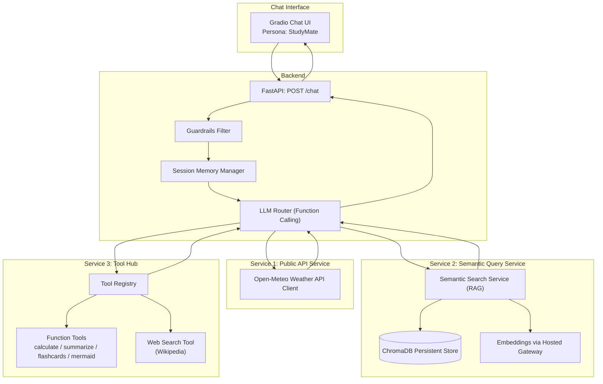

# Assignment 2 — StudyMate: Multi-Service Conversational AI System

StudyMate is a modular conversational AI system built with FastAPI, Gradio, ChromaDB (persistent vector store), and an OpenAI-compatible hosted client.  
It acts as a friendly teaching assistant with structured, concise responses.

---

## What the chat client does

StudyMate supports three coherent services and an intent-based decision process:

1. **Service 1: Public API (Weather)** — answers weather questions by calling a public API and rephrasing results.
2. **Service 2: Semantic Query (RAG)** — answers course/concept questions by retrieving relevant passages from a local knowledge base using ChromaDB persistence.
3. **Service 3: Tool Hub (Extensible tools)** — supports function-style tools (calculator, summarize, flashcards, mermaid diagrams) plus a Wikipedia search tool.

The system maintains **session memory** during the conversation and supports explicit **note/remember** style messages.

---

## Services

### Service 1 — Public API (Weather)
- File: `app/services/weather_api.py`
- Uses a public weather API (Open‑Meteo)
- Returns structured fields internally, but the assistant **rephrases** in natural language (no raw JSON)

### Service 2 — Semantic Query (RAG)
- File: `app/services/semantic.py`
- Persistent vector store: `chroma_store/` (ChromaDB PersistentClient)
- Knowledge base: `data/course_kb.jsonl`
- Embeddings generated via your OpenAI-compatible hosted gateway client

### Service 3 — Tool Hub
- Registry: `app/toolhub/registry.py`
- Tools: `app/toolhub/tools/`
  - `calculate.py` (calculator)
  - `summarize.py` (summarizer)
  - `flashcards.py` (flashcard generator)
  - `mermaid_diagram.py` (Mermaid diagram generator)
  - `websearch_wikipedia.py` (Wikipedia search tool)

All tools implement:
```python
def run(self, args: Dict[str, Any], ctx: ToolContext) -> Dict[str, Any]
```

---

## Architecture



---
## Flow Diagram


## Guardrails

The system blocks:
- Attempts to reveal or modify system/developer instructions (prompt injection)
- Restricted topics required by the assignment:
  - cats or dogs
  - horoscopes / zodiac signs
  - Taylor Swift

---

## Setup

> Run commands from the project root directory (where `pyproject.toml` lives).

### 1) Environment
```bash
cd 05_src/assignment_chat
```

Create/activate your uv environment (Windows):
```bash
uv venv a2-env --python 3.11
source a2-env/Scripts/activate
uv sync --active
```

### 2) Secrets
Create a `.secrets` file at repo root with:
```
API_GATEWAY_KEY=your_key_here
```

### 3) Build / rebuild the vector store
```bash
rm -rf chroma_store
mkdir chroma_store
uv run --active python -m scripts.build_index
```

---

## Running

### Backend (FastAPI)
```bash
uvicorn app.main:app --reload
```

### UI (Gradio)
```bash
python app/gradio_ui.py
```

---

## Test prompts by intent

### A) Semantic (RAG / course concepts)
- What is cosine similarity?
- How does RAG work?
- How does Chroma store embeddings?
- What are guardrails in AI systems?
- Explain embedding models.

### B) Weather (API)
- What's the weather in Toronto today?
- Weather for Mississauga
- Will it rain in Brampton today?

### C) Calculator (tool)
- calc: (19*(6+2)) - 4
- calculate: 1024/16
- 12.5 * 4 - 7/2

### D) Wikipedia (tool)
- wiki lunar eclipse
- wiki: vector database
- wikipedia retrieval augmented generation

### E) Mermaid diagram (tool)
- diagram: architecture
- mermaid: system flow

### F) Summarize (tool)
- Summarize this in bullet points: <<paste text>>

### G) Flashcards (tool)
- Create 5 flashcards from: <<paste text>>

### H) Memory (session memory)
- note my city is Toronto
- remember my favorite topic is RAG
- what city did I tell you?
- do you remember my favorite topic?

---

## Repository structure (cleaned)

The following tree reflects the current repository

```
assignment_chat/
├── .secrets
├── main.py
├── pyproject.toml
├── readme.md
├── requirements.txt
├── .gitignore
├── uv.lock
├── app/
│   ├── __init__.py
│   ├── gradio_ui.py
│   ├── llm_router.py
│   ├── main.py
│   ├── core/
│   │   ├── __init__.py
│   │   ├── guardrails.py
│   │   ├── memory.py
│   │   └── openai_client.py
│   ├── services/
│   │   ├── __init__.py
│   │   ├── calculator.py
│   │   ├── semantic.py
│   │   └── weather_api.py
│   └── toolhub/
│       ├── __init__.py
│       ├── registry.py
│       └── tools/
│           ├── __init__.py
│           ├── calculate.py
│           ├── flashcards.py
│           ├── mermaid_diagram.py
│           ├── summarize.py
│           └── websearch_wikipedia.py
├── data/
│   └── course_kb.jsonl
├── scripts/
│   ├── build_index.py
│   └── chroma_smoke.py
├── tests/
│   ├── conftest.py
│   ├── test_router_smoke,py
│   ├── test_semantic.py
│   └── test_weather.py
└── chroma_store/
    └── (local persistent DB files)
```

### Notes about cleanup

- `chroma_store/` is local persistence output; It is being kept **out of git** (by adding it to `.gitignore`). Rebuild using `scripts/build_index.py` should be done each time.

---

## Summary

StudyMate demonstrates a modular, extensible conversational AI system with:
- Public API integration (Weather)
- Persistent semantic retrieval (ChromaDB RAG)
- Extensible tools (calculator, summarize, flashcards, Mermaid, Wikipedia)
- Guardrails and session memory for realistic conversational behavior
